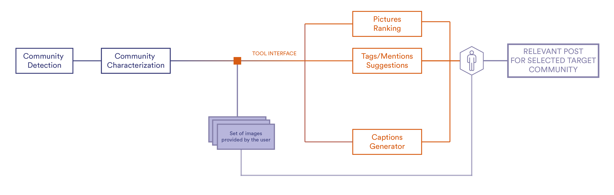
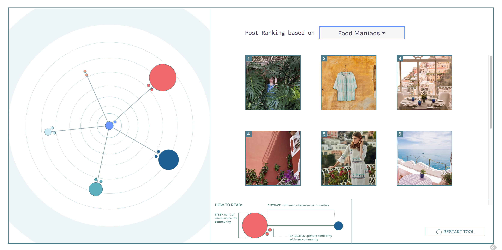
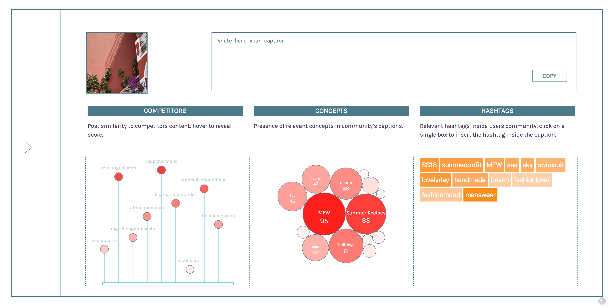

# DATASHACK 2018 - Emporio Sirenuse
## Instagram Data Analysis - Communities Detection and Content Recommendation

### Contents

1. [Introduction and Scope](#introduction-and-scope)
2. [Users Clustering](#users-clustering)
3. [Content Recommendation](#content-recommendation)
4. [Followers Classification](#followers-classification)
5. [The Tool - Frank](#the-tool---frank)
6. [Conclusions and Future Work](#conclusions-and-future-work)

### Introduction and Scope
Le Sirenuse Positano is a luxury 5 star hotel located in Positano, on the Amalfi Coast. Right in front of the hotel, in the Emporio Sirenuse store, tourists and guests can find a collection of dresses and swimwear perfectly aligned with the Mediterranean style of the hotel. The collection, curated by the hotel owner Mrs. Carla Sersale, is also sold online on a dedicated website and on different others online channels. Both the hotel and the store have an official Instagram account, the first one having a much bigger influence with respect to the one of the store. In this setting we were asked to find a way to improve the online presence of the clothing brand by leveraging social media platforms; while protecting its heritage, we wanted to enhance the popularity of the fashion brand independently.

In order to improve the social media presence of the brand and produce relevant insights for the brand managers we needed to intervene on two fronts: we had to identify and characterize communities of users among the followers of the brand and its competitors; given that information we would allow the brand to post relevant content for the community it decides to target. To accomplish those two goals we thought of a complete pipeline that would incorporate two phases: in the first phase we detect communities of users based on their content (pictures and captions); the second one instead, given a set of pictures that the user would like to post, ranks those pictures based on the target community chosen by the user among the ones found during the first phase.

### Users Clustering
We were given access to a dataset composed of Instagram data from the accounts of Emporio Sirenuse and its followers, along with the accounts of 9 other competitors and their followers. We want to:                           

1. Identify methods for feature detection from Social Media text and image data.
2. Cluster Instagram posts of the client’s followers using these features.
3. Detect latent communities based on the distribution of  user posts in different clusters.

This is a difficult task since social media data, while being complex and composed of heterogeneous components (text, image, geo-tags, hashtags, mentions...etc), tends to be very abstract and hard to ascertain. Moreover this heterogeneity also translates into completely different feature detection methods, which are hard to integrate and validate in an unsupervised learning setting like ours.

##### Clustering
We intend to cluster users into specific communities, based on their Instagram activity. In order to do that we cluster all their instagram posts into general clusters, which can be thought of as standard units and then we cluster the users based on their representation in these standard units. This allows us to find communities of users that share interests, and post about the same topics in the same measure.

This clustering system is hinged on finding a latent space that accurately sepearates the posts based on their features and characteristics.
### Content Recommendation
[Kimia Wrote- feel free to edit, restyle, etc]
### Ranking
From the clustering, we have an understanding of the underlying communities of users. 

The intended user, a social media manager for example, will upload his or her pictures (from a photoshoot) to the tool. His/Her goal is to post a picture that best appeals to a chosen community. In other words, the social media manager wants to optimize his/her post for a given community. 

A post can be optimized by two metrics: 1) Whether a post will be similar to a community and 2) Whether a post will be popular to a community.  The later requires an “engagement metric,” or a score that reflects the likelihood it will 

We address these two issues below. 

#### Community Similarity 
Each picture uploaded by the social media manager is passed through the clustering algorithm, and receives a probability score that the picture belongs to each community. The probability scores that a given picture belongs to each community sums to one. Each community also has its own distribution- the compilation of images that have been passed through the clustering algorithm. 

Thus, we have probability distributions that we may measure the similarity between using the Kullback-Leibler Divergence (often shortened to just KL divergence). 

KL Divergences measure the difference between two probability distributions, $p ( x )$ and $q ( x )$ : $$ D ( p \| q ) = \sum _ { x } p ( x ) \log \frac { p ( x ) } { q ( x ) }$$ 

$D$ is nonnegative, asymmetric, zero if and only if $p$ = $q$. Therefore, a lower KL divergence score suggests the two distributions are more similar. 

Once the social media manager identifies the community he/she would like to optimize for, the 

Therefore, we can quantitatively measure the similarity or difference between an uploaded picture and the community. Each uploaded picture is iterated and a KL divergence score is computed by comparing each picture’s distribution with the target communities distribution. The KL scores and then ranked, from lowest to highest, to suggest which pictures best match the target communities’ images. 

#### Engagement 

### Followers Classification
### The tool - Frank

### Conclusions and Future Work
